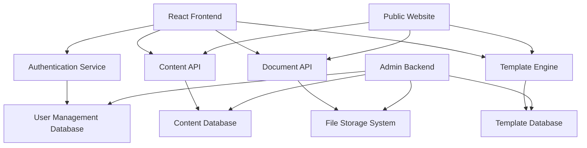

# Design Document

## Overview

The Web Communication CMS is designed as a modern headless content management system specifically tailored for Town and Parish Councils. The architecture separates content management (backend) from content presentation (frontend), enabling flexible content delivery while maintaining strict accessibility standards. The system consists of a Node.js/Express backend API serving a React-based frontend application with role-based authentication and comprehensive document management capabilities.

## Architecture

### High-Level Architecture



### System Components

- **React Frontend Application**: Single-page application providing content editing interface
- **Headless CMS Backend**: RESTful API serving content, user management, and document operations
- **Authentication Service**: JWT-based authentication with role-based access control
- **Template Engine**: Dynamic template system ensuring WCAG 2.2 compliance
- **Document Management System**: File storage with folder-based organization and privacy controls
- **Public Website Interface**: Template-rendered public-facing website
- **Admin Backend Interface**: Developer-only interface for system maintenance

## Components and Interfaces

### Frontend Components

#### Authentication Module
- **LoginComponent**: Handles user authentication with JWT token management
- **AuthGuard**: Route protection based on user roles and permissions
- **UserContext**: React context providing user state throughout application

#### Content Management Module
- **ContentEditor**: WYSIWYG editor with template-aware content creation
- **ContentList**: Displays available content with filtering and search capabilities
- **TemplateSelector**: Interface for selecting and applying content templates
- **PreviewComponent**: Real-time preview of content as it will appear on public site

#### Document Management Module
- **DocumentUploader**: Drag-and-drop file upload with progress tracking
- **FolderManager**: Tree-view interface for organizing documents into folders
- **PermissionManager**: Interface for setting public/private folder permissions
- **DocumentViewer**: In-browser document preview and download functionality

#### User Management Module (Admin Only)
- **UserList**: Display and management of system users
- **UserEditor**: Create and edit user accounts with role assignment
- **PermissionMatrix**: Visual representation of user permissions across system features

### Backend API Interfaces

#### Authentication API
```
POST /api/auth/login
POST /api/auth/logout
POST /api/auth/refresh
GET /api/auth/profile
```

#### Content API
```
GET /api/content
POST /api/content
PUT /api/content/:id
DELETE /api/content/:id
GET /api/content/:id/preview
```

#### Document API
```
GET /api/documents
POST /api/documents/upload
GET /api/documents/:id
DELETE /api/documents/:id
GET /api/folders
POST /api/folders
PUT /api/folders/:id/permissions
```

#### Template API
```
GET /api/templates
GET /api/templates/:id
POST /api/templates (admin only)
PUT /api/templates/:id (admin only)
```

#### User Management API
```
GET /api/users (admin only)
POST /api/users (admin only)
PUT /api/users/:id (admin only)
DELETE /api/users/:id (admin only)
```

## Data Models

### User Model
```typescript
interface User {
  id: string;
  username: string;
  email: string;
  passwordHash: string;
  role: 'administrator' | 'editor' | 'read-only';
  createdAt: Date;
  updatedAt: Date;
  lastLogin: Date;
  isActive: boolean;
}
```

### Content Model
```typescript
interface Content {
  id: string;
  title: string;
  slug: string;
  body: string;
  templateId: string;
  authorId: string;
  status: 'draft' | 'published' | 'archived';
  metadata: Record<string, any>;
  createdAt: Date;
  updatedAt: Date;
  publishedAt: Date;
}
```

### Document Model
```typescript
interface Document {
  id: string;
  filename: string;
  originalName: string;
  mimeType: string;
  size: number;
  folderId: string;
  uploadedBy: string;
  createdAt: Date;
  metadata: {
    title?: string;
    description?: string;
    tags?: string[];
  };
}
```

### Folder Model
```typescript
interface Folder {
  id: string;
  name: string;
  parentId: string | null;
  isPublic: boolean;
  permissions: {
    read: string[];
    write: string[];
  };
  createdBy: string;
  createdAt: Date;
  updatedAt: Date;
}
```

### Template Model
```typescript
interface Template {
  id: string;
  name: string;
  description: string;
  htmlStructure: string;
  cssStyles: string;
  accessibilityFeatures: {
    skipLinks: boolean;
    headingStructure: boolean;
    altTextRequired: boolean;
    colorContrastCompliant: boolean;
  };
  contentFields: TemplateField[];
  isActive: boolean;
}

interface TemplateField {
  id: string;
  name: string;
  type: 'text' | 'textarea' | 'rich-text' | 'image' | 'link';
  required: boolean;
  validation: Record<string, any>;
}
```

## Error Handling

### Frontend Error Handling
- **Global Error Boundary**: React error boundary catching and displaying user-friendly error messages
- **API Error Interceptor**: Axios interceptor handling HTTP errors and token refresh
- **Form Validation**: Real-time validation with accessibility-compliant error messaging
- **Network Error Handling**: Offline detection and retry mechanisms

### Backend Error Handling
- **Centralized Error Middleware**: Express middleware for consistent error response formatting
- **Validation Errors**: Input validation with detailed field-level error messages
- **Authentication Errors**: Proper HTTP status codes and security-conscious error messages
- **File Upload Errors**: Handling of file size limits, type restrictions, and storage failures
- **Database Errors**: Connection handling and transaction rollback mechanisms

### Error Response Format
```typescript
interface ErrorResponse {
  success: false;
  error: {
    code: string;
    message: string;
    details?: Record<string, any>;
    timestamp: string;
  };
}
```

## Testing Strategy

### Frontend Testing
- **Unit Tests**: Jest and React Testing Library for component testing
- **Integration Tests**: Testing component interactions and API integration
- **Accessibility Tests**: Automated WCAG 2.2 compliance testing using axe-core
- **End-to-End Tests**: Cypress tests covering complete user workflows
- **Visual Regression Tests**: Screenshot comparison for template consistency

### Backend Testing
- **Unit Tests**: Jest for individual function and method testing
- **API Tests**: Supertest for endpoint testing with various user roles
- **Database Tests**: Testing data models and repository patterns
- **Security Tests**: Authentication, authorization, and input validation testing
- **Performance Tests**: Load testing for content delivery and file uploads

### Accessibility Testing
- **Automated Testing**: Integration of axe-core in CI/CD pipeline
- **Manual Testing**: Keyboard navigation and screen reader compatibility
- **Color Contrast Validation**: Automated checking of template color combinations
- **Focus Management**: Testing of focus order and visibility in dynamic content

### Test Data Management
- **Fixtures**: Predefined test data for consistent testing scenarios
- **Database Seeding**: Automated setup of test environments with sample data
- **File Upload Testing**: Mock file storage for document management testing
- **User Role Testing**: Comprehensive testing of permission-based functionality

## Security Considerations

### Authentication & Authorization
- JWT tokens with secure storage and automatic refresh
- Role-based access control with granular permissions
- Password hashing using bcrypt with appropriate salt rounds
- Session management with secure logout and token invalidation

### Data Protection
- Input sanitization and validation on all user inputs
- SQL injection prevention through parameterized queries
- XSS protection through content sanitization
- CSRF protection using tokens for state-changing operations

### File Security
- File type validation and virus scanning for uploads
- Secure file storage with access control
- Prevention of directory traversal attacks
- File size limits and quota management

### API Security
- Rate limiting to prevent abuse
- CORS configuration for cross-origin requests
- HTTPS enforcement for all communications
- API versioning for backward compatibility